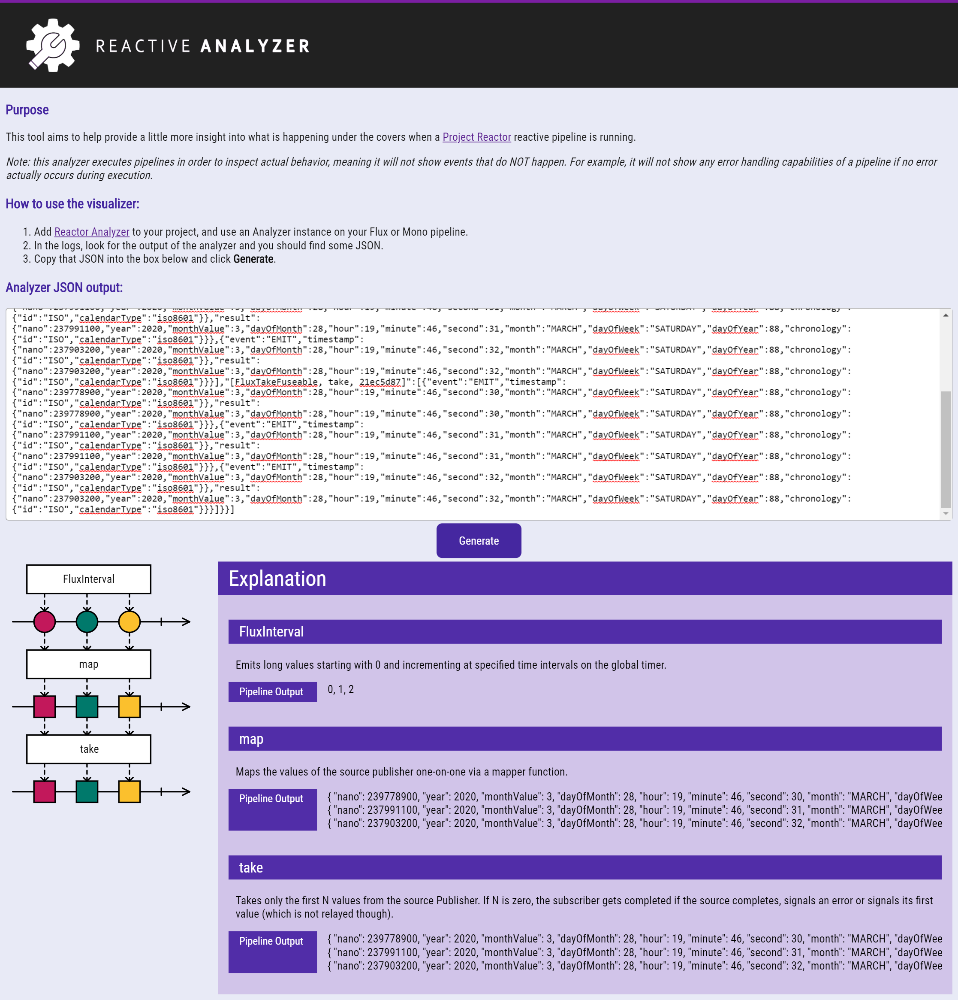

# Reactor Analyzer
A reactive pipeline tool that helps developers to see what is happening during execution.

### Background
The reactive paradigm requires a shift in thinking compared to the more traditional imperative and stateful approach to software development.
Because of this, it can be difficult to understand what is truly happening when a reactive pipeline is being executed.

A lot of the online tutorials explain things such as how to use the `log()` method to help explain the execution path, and when things go wrong they also explain how to make the stack trace make more sense.

What would be nice however, is something that explains the flow of a pipeline as it happened. What did it do to end up with the result it did?

This project is a an attempt to help do just that.

### Usage
Before you can visually see what happened in a pipeline, it is necessary to execute it and analyze its execution path.
We achieve this by using an instance of the `Analyzer` class.

Once the analysis has been done, it is then time to pass the results to the visualizer page. Here, the results are processed
and a marble diagram is constructed that highlights the execution.

_Note that as this project is a work in progress, the marble diagrams are *very* basic and incomplete at this point in time,_ 

#### The `Analyzer`

Analysis is performed by the `Analyzer` class, and so the following steps show how to obtain an instance, perform analysis, and then tidy up by stopping the analyzer.

```groovy
def analyzer = new Analyzer() 
def flux = Flux.fromIterable( Arrays.asList('abcdefghijklmnopqrstuvwxyz'.split('')) )
                .map { s -> s.toUpperCase() }
analyzer.analyze flux
analyzer.stop() 
```

There are a few things to note:
- the `Analyzer` instance must be created BEFORE the pipeline is created.
This is due to the hooks that need to be added prior to pipeline construction. 
- the `analyze()` method may be called many times on different pipelines, but once the `stop()` method is called, the analyzer can no longer be used.
- the `stop()` method is necessary to remove the hooks that were added when the `Analyzer` instance was created. 

This should result in something similar to the following appearing in the logs:

```text
[main] INFO com.javanhe.reactor.analyzer.Analyzer - [{"results":{"[FluxIterable, source(FluxIterable), 22fa55b2]":["a","b","c","d","e","f","g","h"],"[FluxMapFuseable, map, 4d666b41]":["A","B","C","D","E","F","G","H"],"[FluxTakeFuseable, take, 30f4b1a6]":["A","B","C","D","E","F","G","H"]}}]
```

The JSON output explains everything that happened during execution of the pipeline, and at this point we can apply it to the visualizer.

#### The Visualizer
To help visually explain the results, open the static web page `index.htm` in a browser, and paste the JSON from the logs into the input area.
Upon clicking *Generate*, it will draw (to the best of its ability) a marble diagram that should then appear on the page.  

The image below is an example of some generated output:

